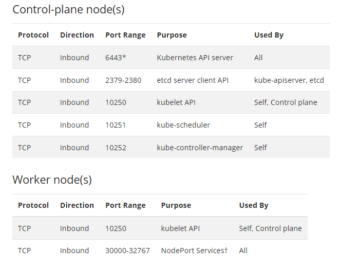
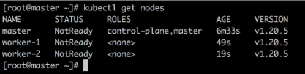

# Instalando o kubernetes

## Pré requisitos
* 2 GB ou mais por máquina.
* 2 CPUs ou mais.
* Conectividade total entre todas as máquinas do cluster (Rede pública ou privada).
* Hostname, MAC address e product_uuid exclusivos para cada nó.
* Desabilitar o Swap. É necessário desabilitar o swap para que o kubelet funcione corretamente.
* Portas que serão expostas:



## **Passo 1:** Desabilitando a Swap
Executar em todos os nodes:
- Atualizar os pacotes da sua distro nos 3 nodes
- Desabilitar a swap: `swapoff -a`
- Comentar a linha da swap no arquivo fstab, para que quando as máquinas forem rebootadas a swap não seja habilitada: `vim /etc/fstab`

## **Passo 2:** Instalando o Docker
Executar em todos os nodes:
- Instalando o Docker: `curl -fsSL https://get.docker.com | bash`
- Conferindo se a instalação foi executada com sucesso: `docker --version`

## **Passo 3:** Adicionando o respositório do Kubernetes
Executar em todos os nodes:
- Importando a chave: `curl -s https://packages.cloud.google.com/apt/doc/apt-key.gpg | apt-key add -`
- Adicionando o repositório: `echo "deb http://apt.kubernetes.io/ kubernetes-xenial main" > /etc/apt/sources.list.d/kubernetes.list`
- Após adicionar o repositório, vamos rodar `apt-get update` para fazer o download da listagem de pacotes disponíveis desse novo repositório.

## **Passo 4:** Instalando o kubelet, kubectl e o kubeadm
* **kubeadm:** Responsável pela montagem do cluster.
* **kubectl:** Responsável pelas interações do cluster.
* **kubelet:** É o agent que roda em todos os nós do nosso cluster e é responsável em se comunicar com a api do master.

Executar em todos os nodes:
- Instalando o kubelet, kubectl e o kubeadm: `apt-get kubelet kubectl kubeadm -y`

**Obs:** Desabilitar o firewall

## **Passo 5:** Iniciando o cluster
Agora vamos escolher umas das máquinas que será a nossa master e seguir com os comandos abaixo:
- Após a definição da master, vamos iniciar o cluster passando como parâmetro o ip do nosso master `kubeadm init --apiserver-advertise-address $(hostname -i)`
- Feito a instalação, vamos criar a cópia do arquivo de configuração que contém as chaves para a comunicação do kubectl com o cluster:
```
mkdir -p $HOME/.kube
sudo cp -i /etc/kubernetes/admin.conf $HOME/.kube/config
sudo chown $(id -u):$(id -g) $HOME/.kube/config
```
- Repare que na saída do comando `kubeadm init --apiserver...`, temos uma linha parecida com essa:
```
kubeadm join <control-plane-host>:<control-plane-port> --token <token> --discovery-token-ca-cert-hash sha256:<hash>
```
- Copie essa linha que contém o token e a hash e cole nos outros nós do cluster. Com isso nós ingressamos os nodes para dentro do cluster.
- Volte na master e certifique se consegue enxergar os nodes: `kubectl get nodes`

- Note que o status ainda está como **NotReady**, para isso vamos precisar instalar podnetwork

## **Passo 6:** Instalando o pod network e testando o cluster
Add-on responsável por fornecer todo o network policy e a comunicação com os pods e nós. Necessário para o funcionamento da rede.
Existem vários add-ons responsáveis por essa tarefa, no nosso exemplo iremos instalar o weave. Caso queria ver outras  [opções](https://kubernetes.io/docs/concepts/cluster-administration/networking/#how-to-implement-the-kubernetes-networking-model)
- Instalando o pod network na master: `kubectl apply -f "https://cloud.weave.works/k8s/net?k8s-version=$(kubectl version | base64 | tr -d '\n')"`
- Feito isso, rode novamente o comando `kubectl get nodes` e veja que agora o status está como **Ready**.
- Agora o cluster já está funcional e pronto para uso, exemplo: `kubectl run nginx --image nginx --replicas 10`

